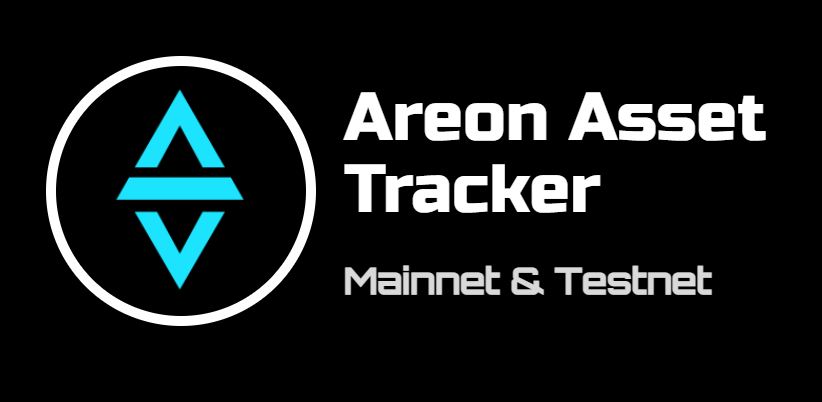

# Areon Assets Tracker
Browser extension & Web app for tracking balances of ARC-20 & ARC-721 assets on Areon Mainnet & Testnet.

## Problem & solution
It is very convenient to have a tool for tracking the balance of assets of your own or other wallets, especially if the blockchain for which it was created has different networks (Mainnet and Testnet).

## Features:
- Light / Dark theme;
- Mobile responsive app;
- Ability to create an account and access all data by logging in through any type of device:
  - PC (web application);
  - Mobile device (web application);
  - Browser extension;
- Ability to add new wallets to your address book and delete unnecessary ones;
- Ability to switch network (Mainnet or Testnet);
- View / track / untrack ARC-20 tokens & NFT collections on Areon Mainnet & Testnet:
- Create & Mint free NFTs on both networks.

## What's next for the project ?
- Adding logo images for more ARC-20 tokens;
- Tracking transfer transactions of ARC-20 tokens;
- Tracking more NFT collections;
- etc

## Demo screens:
  <table>
  <tr>
    <td></td>
    <td></td>
    <td></td>
  </tr>
  <tr>
    <td></td>
    <td></td>
    <td></td>
  </tr>
</table>
